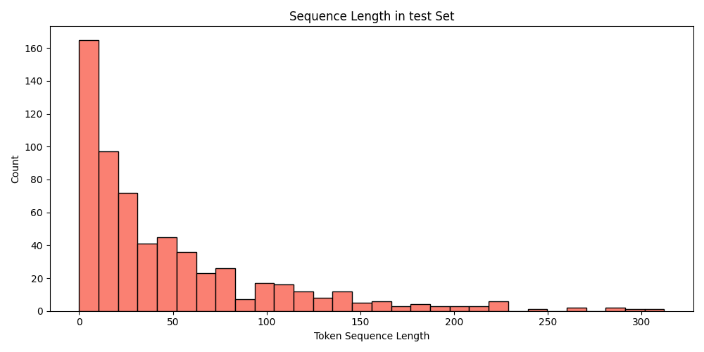

# Punctuation Restoration with BiLSTM: A Baseline for Literary Texts

## Abstract

In the task of recovering missing punctuation from literary texts, we implemented a baseline model using a deep neural network architecture. Our model consists of a Bidirectional Long Short-Term Memory (BiLSTM) followed by a linear classifier that predicts 9 types of punctuation marks commonly removed from *Sherlock Holmes* stories. 

On a randomly selected validation set drawn from the training data, our model achieves a **macro F1 score of 49%** and a **weighted average F1 score of 80%**. On the test set (comprising three unseen Sherlock Holmes stories), the model scores a **macro F1 of 44%** and a **weighted F1 of 75%**. In future work, we plan to train on larger and more diverse text sources, and incorporate richer architectures such as Transformers to better capture long-range dependencies in the text.

---

## Introduction

The goal of this project is to restore missing punctuation marks from a given input sequence of words using deep learning. The challenge is framed as a sequence labeling problem, where each `<punctuation>` placeholder must be replaced with the correct punctuation mark.

The evaluation is performed on three specific stories by Arthur Conan Doyle:

- *A Scandal in Bohemia*
- *The Red-headed League*
- *A Case of Identity*

To avoid data leakage, we were instructed to train only on **legal public-domain data** distinct from these test stories. We curated our training data primarily from *The Adventures of Sherlock Holmes* and avoided overlapping chapters with the test set.

---

## Exploratory Data Analysis (EDA)

Before model development, we performed an extensive exploratory data analysis to better understand the structure of the data. This included computing:

- Sequence length distributions
- Per-class punctuation frequencies
- Distributional differences between train, test, and validation sets

### Test Set Statistics

| Metric                 | Value          |
|------------------------|----------------|
| Total sequences        | 617            |
| Avg sequence length    | 48.31          |
| Max sequence length    | 312            |
| Median sequence length | 28             |
| Std deviation          | 2.18           |

### Punctuation Frequencies in Test Set

  
  

| Punctuation | Count |
|-------------|-------|
| ,           | 1879  |
| ;           | 46    |
| :           | 9     |
| !           | 62    |
| ?           | 176   |
| .           | 1526  |
| '           | 194   |
| "           | 1316  |
| (           | 1     |
| )           | 1     |

---

## Data pre-processing

Initially, we included various public-domain books (e.g., *Dracula*, *Pride and Prejudice*), but performance degraded slightly, likely due to style mismatches. We ultimately restricted the training data to Sherlock Holmes stories *excluding the test chapters*. 

We preprocessed each story by:

- Removing Gutenberg boilerplate headers and footers
- Replacing ASCII quotes with UTF-8 equivalents
- Tokenizing and inserting `<punctuation>` markers in place of real punctuation
- Building JSON-based datasets containing `[tokens, labels]` pairs

---

## Model Architecture

Given the sequential nature of the task, we implemented a **BiLSTM** model — a natural fit for capturing context around missing punctuation points.

### Components

- **Embedding layer**: maps tokens to 128-dimensional vectors
- **BiLSTM layer**: hidden size 192, bidirectional
- **Dropout**: 0.4 for regularization
- **Linear classifier**: outputs logits over 9 punctuation classes

Input → Embedding → BiLSTM → Dropout → Linear → Softmax
