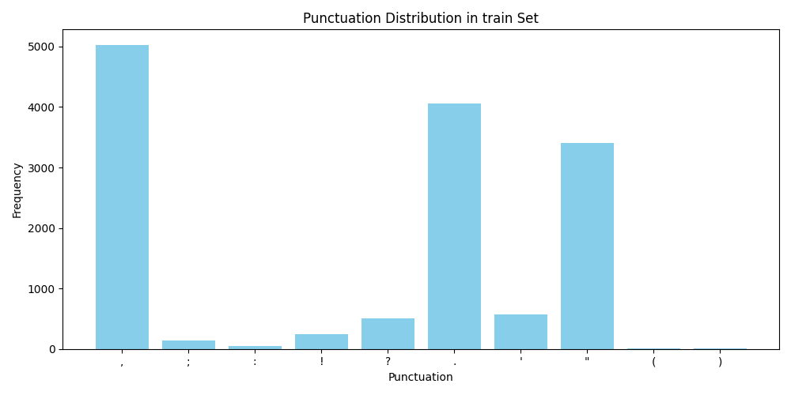

# Punctuation Restoration with a BiLSTM Baseline

## Abstract

In this task, we address restoring missing punctuation in literary texts, focusing on Sherlock Holmes stories as our primary dataset. To establish a strong baseline, we implemented a deep neural model consisting of a Bidirectional Long Short-Term Memory (BiLSTM) network followed by a linear classifier to predict 9 common punctuation marks.

Our model achieves a macro F1 score of 40.83 on the test set. Due to the presence of several underrepresented punctuation classes, these rare labels yield low individual F1 scores, while the more frequent classes (e.g., commas and periods) are predicted with high accuracy. This results in a high weighted F1 score of 81.14%, reflecting the class imbalance in the dataset.

For future work, we plan to expand training to larger and more diverse corpora and explore more expressive architectures, such as Transformers, to better capture long-range dependencies and improve performance across rare punctuation classes.

---

## Introduction

The goal of this task is to restore missing punctuation marks from a given input sequence of words using deep learning. The challenge is framed as a sequence labeling problem, where each `<punctuation>` placeholder must be replaced with the correct punctuation mark.

The evaluation is performed on three specific stories by Arthur Conan Doyle:

- *A Scandal in Bohemia*
- *The Red-headed League*
- *A Case of Identity*

To avoid data leakage, we were instructed to train only on **legal public-domain data** distinct from these test stories. We curated our training data primarily from *The Adventures of Sherlock Holmes* and avoided overlapping chapters with the test set.

---

## Exploratory Data Analysis (EDA)

Before model development, we performed an extensive exploratory data analysis to better understand the structure of the data. This included computing:

- Sequence length distributions
- Per-class punctuation frequencies
- Distributional differences between train, test, and validation sets

### Punctuation Frequencies in Test Set and Test Set Statistics

  
  

---

## Data pre-processing

Initially, we included various public-domain books (e.g., *Dracula*, *Pride and Prejudice*), but performance degraded slightly, likely due to style mismatches. We ultimately restricted the training data to Sherlock Holmes stories *excluding the test chapters*. The goal is the training data be similar distribution to test data.
### Punctuation Frequencies in Train Set and Train Set Statistics

  
  

The training data is about three times of testing data which we need to augment it in the future iteration. We preprocessed each story by:

- Removing Gutenberg boilerplate headers and footers
- Replacing ASCII quotes with UTF-8 equivalents
- Tokenizing and inserting `<punctuation>` markers in place of real punctuation
- Building JSON-based datasets containing `[tokens, labels]` pairs

The preprocessing helped us choose a few parameters and design parts of the task. For instance, after analyzing the training data, we saw that 95% of the sequences were around 512 tokens or less, so we set MAX_SEQ_LEN to 512 to cover most cases without truncating important content. 
Further, for the validation set, we selected the story from Chapter XII of the Gutenberg Project collection, as it was the only one among the remaining nine chapters that included the underrepresented punctuation marks: "(" and ")".

---

## Model Architecture

Given the sequential nature of the task, we implemented a BiLSTM model — a natural fit for capturing contextual information around missing punctuation marks. Bidirectional LSTMs process input sequences from both left-to-right and right-to-left, allowing the model to learn dependencies from both past and future tokens. This is especially important for punctuation restoration, where cues for a missing symbol may appear before or after the placeholder. Unlike unidirectional models, a BiLSTM can better infer these patterns by attending to the full surrounding context, making it well-suited for sequence labeling tasks like ours.

Input: ["the", "<punctuation>", "dog", "barked", "<punctuation>"]

               ↓↓↓
       Bidirectional LSTM
     (reads left → right and right → left)

               ↓↓↓
     Concatenated hidden states

               ↓↓↓
         Linear + Softmax
     (predicts punctuation class)

Output: [",", "."]

### Components

- **Embedding layer**: maps tokens to 64-dimensional vectors
- **BiLSTM layer**: hidden size 64, bidirectional
- **Dropout**: 0.4 for regularization
- **Linear classifier**: outputs logits over 10 punctuation classes

Input → Embedding → BiLSTM → Dropout → Linear → Softmax

All the above-mentioned dimensions were quickly tuned based on performance on the validation set. Additionally, we applied a weight decay of 1e-5 to further regularize the model parameters and reduce overfitting.

## Data Pipline

Part of the data preprocessing was already provided, where the texts are tokenized and punctuation markers are inserted.
- "<punctuation>": a placeholder for where a punctuation mark was originally present
- "<unk>": used for out-of-vocabulary tokens during validation and testing
Example:
["yesterday", "<punctuation>", "i", "went", "to", "<UNK>", "park", "<punctuation>"]
Labels: [",", "."]

Before training, the vocabulary and punctuation label mappings are built using only the training data to prevent data leakage. A custom collate function pads or truncates sequences to a fixed maximum length.

During evaluation and inference, the same preprocessing pipeline is used: tokenizing the text, replacing punctuation with <punctuation> placeholders, and generating ground truth labels. This ensures consistent formatting between training and evaluation without exposing the model to unseen data during vocab construction.

## Experiments
We began with standard hyperparameters and applied light tuning to improve performance. This included increasing dropout to reduce overfitting and reducing the hidden layer size to limit model capacity.

Final Hyperparameters:

- EMBEDDING_DIM: 64
- HIDDEN_DIM: 64
- DROPOUT: 0.4
- MAX_SEQ_LEN: 524
- BATCH_SIZE: 16
- EPOCHS: 40
- LEARNING_RATE: 3e-4
- WEIGHT_DECAY: 1e-5

To stabilize training and avoid overfitting, we also implemented:

- A learning rate scheduler (starting at 3e-4, reducing when validation F1 plateaus)
- An early stopping mechanism with patience = 5 based on validation F1

## Results

We evaluate our model on both validation (from train split), and the official test set. The validation set results are:
- Macro F1: 42.50%
- Weighted F1: 80.79%

The per class f1 on test set are shown here:

The test set f1 scores are:
- Macro F1: 40.83%
- Weighted F1: 81.14%

These results indicate a solid baseline, but highlight the challenge of rare class prediction in imbalanced literary data.

## Error Analysis

To investigate the results further, we show the test set confusion matrix here:

The model performs well on frequent punctuation marks such as ", ., and ,. However, performance drops significantly for rare punctuation classes like :, ;, (, and ). Common confusions include ":" and "." as well as ";" and ",".

For example, the colon : appears in three distinct contexts in the test set:

- In time expressions (e.g., 5:15)

- As an introducer of quoted speech (e.g., "The Coroner: Did your father say anything?")

- To elaborate or emphasize a preceding clause

However, these are rare cases both in training and test sets. To improve performance on such cases, we propose the following steps:

- Increasing Training Data size: Identify and incorporate training texts that exhibit similar narrative structures and punctuation usage to the test data. For example, classic literature, or dialog-heavy prose that mimics the stylistic tone of Conan Doyle’s writing.

- Transformer-based Architectures: While BiLSTM is effective for capturing short-range dependencies, attention-based architectures like transformers (e.g., BERT, Longformer) can model longer sequences and are likely to capture global context more effectively. This could improve the model’s ability to disambiguate punctuation that depends on broader sentence structure.

## Relevant Literature
A brief survey of the literature shows that deep neural networks have been widely explored for punctuation prediction tasks, often with strong results in domain-specific applications:

- Zelasko et al. (2018)
Punctuation Prediction Model for Conversational Speech
https://arxiv.org/abs/1807.00543
This paper explores two deep learning models — a BiLSTM and a CNN — for punctuation restoration in conversational speech, trained on the Fisher corpus. Their approach treats punctuation prediction as a sequence labeling problem.

- Xiaoyin Che et al. (2016)
Punctuation Prediction for Unsegmented Transcript Based on Word Vector (LREC 2016)
The authors propose a CNN or DNN model that uses only pre-trained word vectors as input. Their model predicts whether punctuation should follow a particular word in a 5-word sequence, and if so, which punctuation mark. The dataset used was TED Talks from the IWSLT corpus.

- Chin Char Juin et al. (2017)
Punctuation Prediction Using a Bidirectional Recurrent Neural Network with POS Tagging (TENCON 2017)
This work introduces a BiRNN model enhanced with attention mechanisms and part-of-speech (POS) tags. It handles 11 punctuation classes and is trained on the WikiText corpus.

These works highlight that punctuation recovery is a nuanced task requiring both syntactic and semantic understanding — and that neural models can effectively learn such patterns when provided with appropriate data and contextual features.
